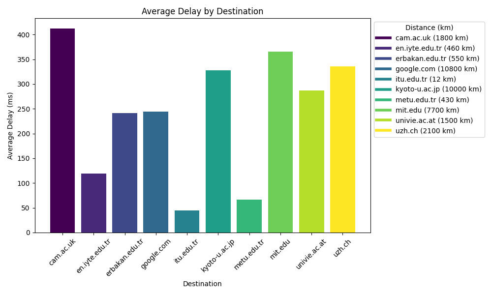
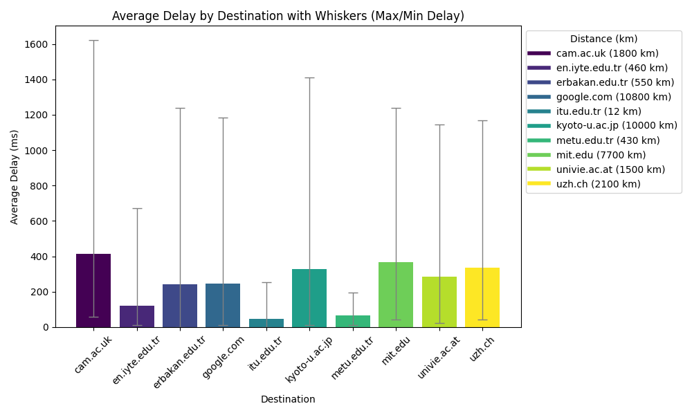
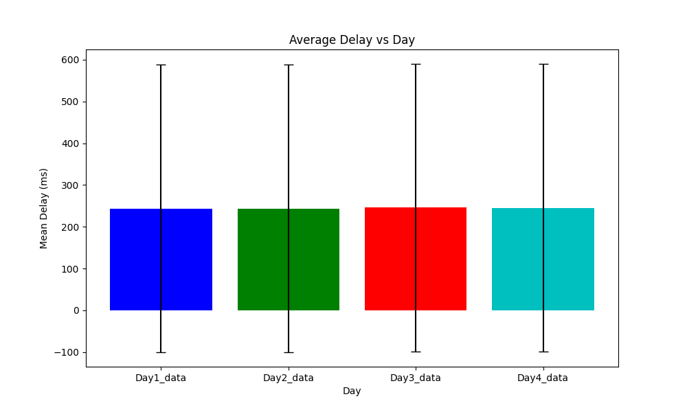
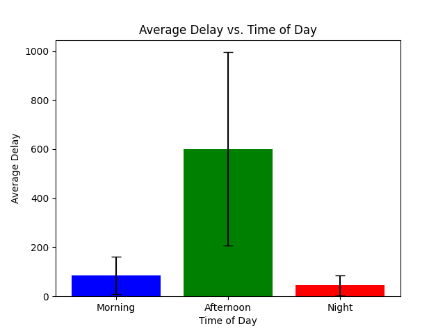

# Name: Abdullah Jafar Manosur Shamout
# Student_id: 150200919
# General
In this file I explain the methodologies that I used throughout this project. I wrote my report and comments in the last section and in the other sections I discussed general information about how I did my project.

## Data Collection and Analysis

This project involved data collection, analysis, and visualization using various Python scripts. The primary goal is to perform traceroute calls to different destinations, collect data, and generate statistical measurements and plots based on the collected information.

## Traceroute Script

To collect the data, I wrote a Python script named `traceroute_script.py`. This script performs traceroute calls to 10 different destinations, each with varying distances from the call point. The distance from the call point to each destination is determined using an IP geolocator, which is compared with the current position. The script then saves the output data, including all hops, into a CSV file. I ran the csv file using my wsl system and I sat the counter in an incrementing way from 10 to 110 by mistake instead of 100 which gave me 560 data points for every session that I started the code for. The file name is in the following format: DayX_YYYYYY_data.csv where X is the day and YYYYYY is the time of day which can be morning/afternoon/night. I mainly used that script to collect the data, eventhough it took a long time, it gave actual results, when I tried using `traceroute_parallel_script.py` that I wrote, I would get blocked from all the hosts and my data would be just junk but I kept it in the scripts section if needed.

## Statistics Script

After collecting the traceroute data, the next step is to extract the information that is most relevant, mainly the last hop, which corresponds to the host server when the traceroute command is able to reach it. This is achieved using the `statistics_script.py` program. After execution, we will have N data records per host name, as N traceroute calls were made for each host using the `traceroute_script`. N would vary from 10 to 100 depending on how much I am setting it.

## Statistical Measurements

From the collected data, a table with the requested statistical measurements is generated. These measurements are:

- Minimum
- Maximum
- Average

The results are output as a text file using the pipelining symbol `>>` through the terminal, providing a summary of the collected data. I did this as a total for all the 560 data records that I collected dureing each session.

## Plotting

To visualize the data for the last hop of each iteration, I wrote 5 Python scripts named `plot_distance.py`, `plot_distance_whiskers.py`, `plot_time.py`, `plot_time_whiskers.py`, and `plot_time.py`. These scripts would generate diagrams related to a single variating variable while the others are fixed. Scripts ending with whiskers, include whiskers that show general standard deviation in the data showing the maximum and minimum values that would help in interpreting the data. The plots offer insights into the characteristics and variations of the last hop for the different destinations.

## File structure
My Day data is saved in folders named as DayX_data where X refers to which day it was. I started from Tuesday to Friday. In each folder I have 3 folders containing data relevant to the time of when the data was collected; Morning, Afternoon, and night. In each of those folders I have my data in csv files. A file shows the entirety of each call with all the hops, another one shows only the last hop for each call; it is generated using the statistics script, and there is a statistics txt file that shows general statistics about the data.

## Conclusion and my report/comments on the data

Starting with the delay_vs_destination diagram. The way I would interpret it is as follows:

The data seems to have least delay at `itu.edu.tr` and `metu.edu.tr` which makes a lot of sense as they are the two closest locations to me and they have good infastructure to support traffic at fast speeds. After those locations comes `en.iyte.edu.tr` which has nearly double the delay of the previous hosts eventhough it is at a similar distance to that of metu. I would contribute this fact to the infastructure that they have and the traffic that they get. Maybe since they dont have as much traffic as metu or itu, they dont care much about the infastructure speed as long as its fast enough which it is. Then we see `erbakan.edu.tr` with similar delay to `google.com`; however, their distance difference from the soucre location is double! I would say this is the case since google.com is amongst the most used sites ever, so to support such traffic they utilized technology and infastructure that is unparalleled by any other host. That is why despite the big distance difference they have similar delays. Then we see the rest of the locations being far and having high delay speeds compared to others.

So in this data I can see two trends, the closer we get to the host the less the average delay is. And the better the host provider holds their infastructure, the lower the average delay is.

We can also see fluctuation for this data in the diagram below using whiskers 
We can see that cambridge had the highest whisker range which showes high variance of the data, which suggests instability. By looking at the variance in itu and metu, we can conclude that more variance occurs as we increase the distance of the host from the requestors position.

As for the delay that I found over the days that I collected it was nearly identical as it can be seen below but the values are different if you zoom in.
 I would contribute this to the fact that I calculated all the data in weekdays when there was no special occasions for any other variable to cause a difference. Thus this would suggest that during workdays the average delay is very similar with similar variations and a drop would be expected during weekends or an increase during special days such as registration days.

And finally for my last diagram I will discuss my diagram of average delay against time of the day as it can be seen below

As it can be seen by the data the average delay is maximum during afternoons and minimal during the nights. I would suggest this is due to traffic and that most of these websites are accessed by students and that students mostly use them during the afternoon. So this would cause higher delay values and higher variation in the values during the afternoon. 

The morning and night delay amounts being significantly lower makes sense as students dont access those websites much during those times, but we see the morning being a bit higher which is probably due to students being early risers and needing to check stuff early in the morning like their emails or announcments.

## Final thoughts
This project taught me a lot about internet traffic and infastructure with measuring delay over different destinations, times, and days. Using traceroute helped me collect data which I then interpreted using scripts that I wrote.