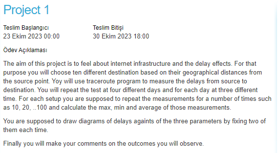
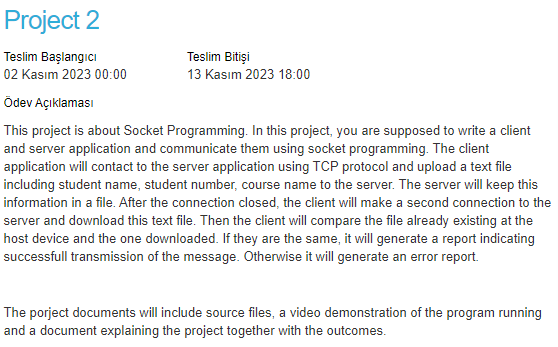
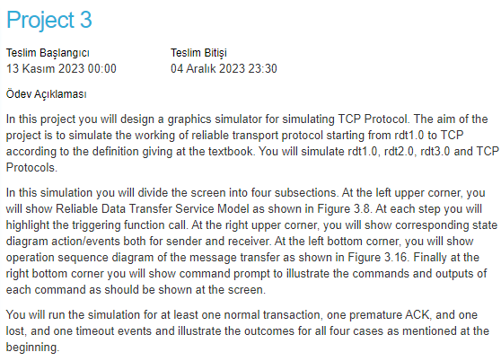
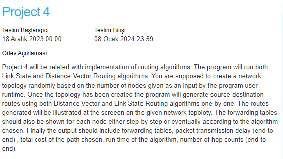

# Principles of Computer Communications BLG337E

This repository contains materials related to the homework assignments and resources for the course. Below, you will find information on each homework assignment along with my marks from the projects.

## General Remarks
The assignments felt very unrelated to the course material since we would do the main topic which would be an algorithm/ command/... etc and the rest would be dealing with the user interface. The course material was very theoretical and the assignments were very practical from a user prespective. The assignments were very time consuming and required a lot of effort to have a good GUI for the user, especially that the libraries used were not common preknowledge. I would have preferred if the assignments were more related to the course material instead of trying to write a bunch of simulators. Also the marking of the homeworks felt unfair since regardless of what you did everyone got around the same grade. The professor that puts the homeworks would expect something but the assistant would not care much as long as general guildens are followed since the homeworks were very open ended with minimum guidlines. This made spending time on the homeworks a waste of time.

## Marks Overview

## Homework Assignments

### Homework 1

### Homework 2

### Homework 3

### Homework 4

