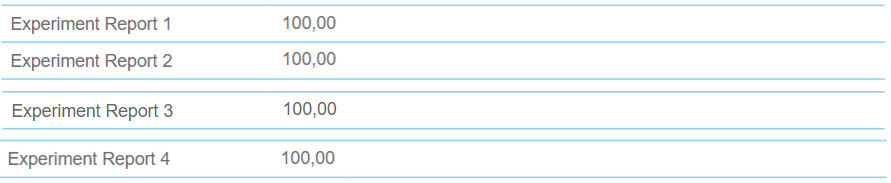

# logic circuits laboratory BLG242E
I found this class very fun and interesting. We had to make groups of 2 to work together on assignments through out the semester. My teammate was Muhammed Yusuf Mermer, great person btw check out his github account [mymermer](https://github.com/mymermer). We had 3 homeworks and 4 experiments, before each experiment a quiz would take place to determine whether you can enter it or not. The quizzes were from topics from digital circuits.
Regarding the class it was not hard it just takes a lot of effort despite it being considered as 1 credit in our university. I would advice you not to spend too much time on it as it takes A LOT, find yourself a great teammate, and look at the booklets a bit before coming to the experiment

# Report Grades

# Homework Grades

