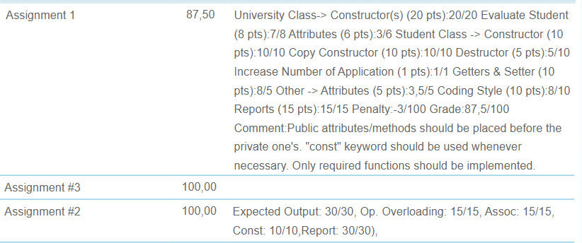

# Object Oriented Programming BLG252E
If you enter the classes regularly you can do the assignments with ease. The course helps you learn a few new concepts about OOP in C++, it also teaches you how to write clean code. I took the class from Doç.Dr. Feza Buzluca, he explains well, maybe a bit slow but everything he says is understandable and his slides are very detailed and well composed.
# My Assignment marks

