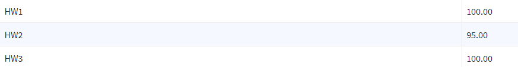

# Operating Systems BLG312E

I took the class from prof. Kemal Bıçakçı. The assignments were done in C and are taken from the OSTEP book with very minimal changes. They are decent in terms of difficulty and are mostly real life implementations of the concepts discussed in the book. The book is available for free online.

# My Assignment marks

